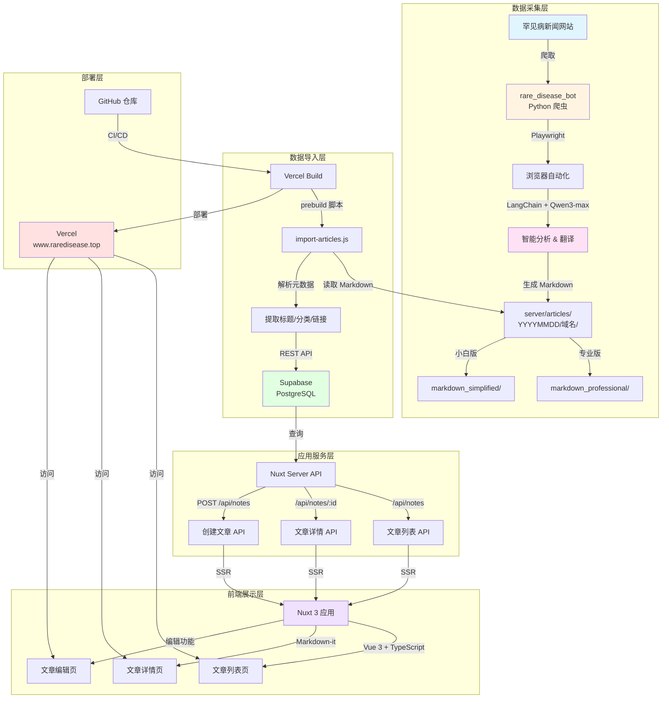

# Rare Disease Info Platform

一个基于 Nuxt 3 的罕见病文章平台，集成了智能新闻爬虫系统，用于收集、翻译和展示罕见病相关的新闻文章。

🌐 **在线访问**: [www.raredisease.top](https://www.raredisease.top)

> ⚠️ **注意**: 本项目是 [上游仓库](https://github.com/OpenRareDisease/info_platform) 的 fork，用于 Vercel 部署（免费版 Vercel 只能关联个人 private 仓库）。由于只有 repo owner 的提交才能触发 CD，开发流程为：**先在 [下游仓库](https://github.com/demongodYY/info_platform_fork) 仓库创建分支，提 PR 给 Owner → Owner 合并触发 CD → 再提 PR 给上游仓库**。详见 [开发流程](#-开发流程) 部分。

## 🏗️ 架构图



## ✨ 功能特性

- 📰 **文章展示**：优雅的文章列表和详情页，支持 Markdown 渲染
- ✍️ **内容管理**：支持创建和编辑文章
- 🤖 **智能爬虫**：自动爬取罕见病新闻并翻译成中文（专业版和小白版）
- 🔄 **自动同步**：构建时自动将爬取的文章导入到数据库
- 🎨 **现代化 UI**：响应式设计，支持移动端

## 🛠️ 技术栈

### 前端框架
- **[Nuxt 3](https://nuxt.com)** - Vue 3 全栈框架
- **[Vue 3](https://vuejs.org)** - 渐进式 JavaScript 框架
- **[TypeScript](https://www.typescriptlang.org)** - 类型安全的 JavaScript
- **[Sass](https://sass-lang.com)** - CSS 预处理器

### 后端服务
- **[Supabase](https://supabase.com)** - 开源 Firebase 替代品（PostgreSQL 数据库）
- **Nuxt Server API** - 服务端 API 路由

### 工具库
- **[Markdown-it](https://github.com/markdown-it/markdown-it)** - Markdown 解析器
- **[ESLint](https://eslint.org)** + **[Prettier](https://prettier.io)** - 代码规范和格式化
- **[Husky](https://typicode.github.io/husky)** - Git hooks 管理

### 子项目：rare_disease_bot
- **[LangChain](https://www.langchain.com)** - LLM 应用开发框架
- **[Playwright](https://playwright.dev)** - 浏览器自动化
- **[Qwen3-max](https://dashscope.aliyuncs.com)** - 阿里云通义千问大模型
- **Python 3** - 爬虫脚本运行环境

### 部署
- **[Vercel](https://vercel.com)** - 前端部署平台

## 📁 项目结构

```
.
├── pages/                    # Nuxt 页面路由
│   ├── index.vue            # 文章列表页
│   └── notes/               # 文章相关页面
│       ├── [id].vue         # 文章详情页
│       └── edit.vue         # 文章编辑页
├── server/                  # 服务端代码
│   ├── api/                 # API 路由
│   │   └── notes/           # 文章相关 API
│   ├── articles/            # 爬虫生成的文章（Markdown）
│   ├── plugins/             # 服务端插件
│   └── scripts/             # 构建脚本
│       └── import-articles.js  # 文章导入脚本（prebuild）
├── rare_disease_bot/        # 智能新闻爬虫子项目
│   ├── config/              # 配置文件
│   ├── core/                # 核心功能模块
│   │   ├── agent.py         # 爬虫 Agent
│   │   ├── browser_tools.py # 浏览器工具
│   │   ├── explorer.py      # 网站结构探索器
│   │   ├── extractor.py     # 内容提取器
│   │   └── markdown_generator.py  # Markdown 生成器
│   ├── utils/               # 工具函数
│   ├── main.py              # 爬虫入口
│   └── requirements.txt     # Python 依赖
├── types/                   # TypeScript 类型定义
├── nuxt.config.ts          # Nuxt 配置
├── package.json            # Node.js 依赖
└── README.md               # 项目说明文档
```

## 🚀 快速开始

### 环境要求

- Node.js >= 18
- Python 3.8+（用于运行 rare_disease_bot）
- Supabase 账户（用于数据库）

### 1. 安装依赖

```bash
# 安装 Node.js 依赖
npm install
# 或
pnpm install --shamefully-hoist
# 或
yarn
```

### 2. 配置环境变量

创建 `.env` 文件（如果不存在）：

```bash
# Supabase 配置
SUPABASE_URL=your_supabase_url
SUPABASE_KEY=your_supabase_anon_key
SUPABASE_SERVICE_KEY=your_supabase_service_key  # 用于 prebuild 脚本
```

### 3. 运行开发服务器

```bash
npm run dev
```

访问 http://localhost:3000 查看应用。

### 4. 构建生产版本

```bash
npm run build
```

构建时会自动执行 `prebuild` 脚本，将 `server/articles/` 目录下**当天**的文章导入到 Supabase。

> 📝 **提示**：如果需要添加新文章，请先运行爬虫（见下方 [使用 rare_disease_bot 爬虫](#-使用-rare_disease_bot-爬虫）部分），然后将文章文件提交并推送代码。

### 5. 预览生产构建

```bash
npm run preview
```

## 📝 使用 rare_disease_bot 爬虫

`rare_disease_bot` 是一个独立的 Python 子项目，用于爬取罕见病新闻。**需要手动在本地运行爬虫来爬取文章**。

### 安装爬虫依赖

```bash
# 进入爬虫目录
cd rare_disease_bot

# 创建虚拟环境
python3 -m venv venv
source venv/bin/activate  # Windows: venv\Scripts\activate

# 安装 Python 依赖
pip install -r requirements.txt

# 安装浏览器依赖（必需）
playwright install chromium
```

### 配置爬虫环境变量

在 `rare_disease_bot/.env` 文件中配置：

```bash
OPENAI_API_BASE=https://dashscope.aliyuncs.com/compatible-mode/v1
OPENAI_API_KEY=your_api_key
MODEL_NAME=qwen-max
```

### 运行爬虫

```bash
# 基本用法（建议限制数量，不要爬太多）
python main.py --url https://rarediseases.org/news/ --max-articles 1

# 限制文章数量（推荐）
python main.py --url https://rarediseases.org/news/ --max-articles 20

# 详细输出模式
python main.py --url https://rarediseases.org/news/ --max-articles 1 --verbose
```

> 💡 **提示**：建议使用 `--max-articles` 参数限制爬取数量，避免一次性爬取过多文章。

### 爬虫工作流程

1. **浏览器自动启动**：爬虫会自动启动浏览器并访问目标网站
2. **智能分析**：使用 Qwen3-max 大模型分析页面结构
3. **内容提取**：提取文章完整内容
4. **智能翻译**：自动翻译成中文，生成两个版本：
   - `markdown_professional/` - 专业版中文翻译（保持原文专业性）
   - `markdown_simplified/` - 小白版中文翻译（通俗易懂）
5. **自动保存**：文章会自动保存到 `server/articles/YYYYMMDDHHMM/域名/` 目录

### 数据更新流程

爬虫运行完成后，需要将代码提交并推送以触发数据导入：

```bash
# 1. 查看生成的文章文件
ls server/articles/

# 2. 提交代码（包含爬取的文章）
git add server/articles/
git commit -m "chore: 添加爬取的文章"

# 3. 推送到远程仓库
git push origin main
```

**自动导入流程**：
1. 代码推送到 GitHub 后触发 Vercel CI/CD
2. Vercel 构建时执行 `prebuild` 脚本（`server/scripts/import-articles.js`）
3. 脚本扫描 `server/articles/` 目录下**当天**的文章（按年月日匹配）
4. 只导入 `markdown_professional/` 目录下的专业版文章
5. 解析文章标题、分类、原文链接等元数据
6. 通过 Supabase REST API 导入到数据库
7. 部署成功后，文章会自动出现在网站上

> ⚠️ **注意**：只有当天（按年月日）的文章会被导入，确保爬虫在同一天运行并推送代码。

详细使用说明请参考 [rare_disease_bot/README.md](./rare_disease_bot/README.md)

## 🚢 部署到 Vercel

### 1. 连接 GitHub 仓库

在 [Vercel](https://vercel.com) 中导入你的 GitHub 仓库。

### 2. 配置环境变量

在 Vercel 项目设置中添加以下环境变量：
- `SUPABASE_URL`
- `SUPABASE_KEY`
- `SUPABASE_SERVICE_KEY`

### 3. 部署

Vercel 会自动检测 Nuxt 项目并配置构建命令。每次推送到主分支都会自动部署。

### 构建流程

1. 执行 `npm run build`
2. 自动运行 `prebuild` 脚本（`server/scripts/import-articles.js`）
3. 脚本扫描 `server/articles/` 目录下**当天**的文章（按年月日匹配，格式：`YYYYMMDDHHMM`）
4. 只导入 `markdown_professional/` 目录下的专业版文章
5. 解析文章元数据（标题、分类、原文链接）并导入到 Supabase 数据库
6. 构建 Nuxt 应用
7. 部署成功后，新文章会自动出现在网站上

## 📚 开发指南

### 代码规范

项目使用 ESLint 和 Prettier 进行代码规范检查：

```bash
# 检查代码规范
npm run lint

# 自动修复
npm run lint:fix

# 格式化代码
npm run format

# 检查格式
npm run format:check
```

### Git Hooks

项目配置了 Husky，在提交前会自动运行 lint-staged 检查代码。

## 🔧 技术细节

### 数据流程

1. **爬取阶段**：
   - 手动运行 `rare_disease_bot` 爬取文章
   - 爬虫使用 Qwen3-max 大模型进行智能分析和翻译
   - 自动保存到 `server/articles/YYYYMMDDHHMM/域名/` 目录
   - 生成专业版和小白版两个 Markdown 文件

2. **提交阶段**：
   - 将爬取的文章文件提交到 Git
   - 推送到 GitHub 触发 CI/CD

3. **导入阶段**：
   - Vercel 构建时自动执行 `prebuild` 脚本
   - 扫描当天（按年月日）的文章目录
   - 只导入 `markdown_professional/` 专业版文章
   - 解析元数据并通过 Supabase REST API 导入数据库

4. **展示阶段**：
   - Nuxt 应用从 Supabase 读取数据
   - 通过 SSR 渲染文章列表和详情页
   - 用户可以在网站上查看爬取的文章

### 手动创建文章

除了通过爬虫自动爬取，你也可以在网站上手动创建文章：

1. 访问网站的文章编辑页面
2. 填写文章信息：
   - **标题**：文章标题
   - **标签**：使用逗号分隔，如 `标签一,标签二`
   - **原文链接**：原始文章的 URL
   - **内容**：使用 Markdown 格式编写文章内容
3. 点击保存，文章会立即保存到数据库并显示在文章列表中

### 文章管理

- **查看文章**：在文章列表页查看所有文章
- **查看文章详情**：点击文章标题或 "View detail" 查看完整内容
- **删除文章**：在 Supabase 数据库中可以直接删除不需要的文章

### API 路由

- `GET /api/notes` - 获取文章列表
- `GET /api/notes/[id]` - 获取文章详情
- `POST /api/notes` - 创建新文章
- `PATCH /api/notes/[id]` - 更新文章

### 数据库结构

文章存储在 Supabase 的 `notes` 表中，包含以下字段：
- `id` - UUID
- `title` - 标题
- `content` - Markdown 内容
- `category` - 分类（逗号分隔）
- `source` - 原文链接
- `published_at` - 发布时间
- `updated_by` - 更新者

## 🔄 开发流程

由于 Vercel 免费版限制（只能关联个人 private 仓库），且只有 repo owner 的提交才能触发 CD，本项目采用以下开发流程：

### 流程说明

1. **在[下游仓库](https://github.com/demongodYY/info_platform_fork)开发并提交 PR**
   - 在个人 fork 仓库（当前仓库）创建功能分支进行开发
   - 创建 Pull Request 提交给仓库 Owner

2. **Owner 合并触发 CD**
   - Owner 审查并合并 PR 到主分支
   - Owner 的提交会触发 Vercel CI/CD 自动部署
   - **GitHub Actions 会自动检测部署状态**（最多等待 10 分钟）

3. **自动同步到上游仓库**
   - 部署成功后，GitHub Actions workflow 会自动：
     - 检查当前分支与上游分支的差异
     - 检查是否已存在未合并的同步 PR
     - 向上游仓库自动创建 Pull Request
   - 上游仓库: [OpenRareDisease/info_platform](https://github.com/OpenRareDisease/info_platform)

### 自动化工作流程

```
代码推送到 main 分支（Owner 合并 PR 后）
    ↓
GitHub Actions 自动触发
    ↓
检查 Vercel 部署状态（最多等待 10 分钟）
    ↓
部署成功或超时
    ↓
检查是否有变更（与上游仓库对比）
    ↓
检查是否存在未合并的同步 PR
    ↓
自动创建 PR 到上游仓库 ✨
```

### 工作流程示例

```bash
# 1. 在[下游仓库](https://github.com/demongodYY/info_platform_fork)创建功能分支
git checkout -b feat/new-feature
git add .
git commit -m "feat: 添加新功能"
git push origin feat/new-feature

# 2. 在 GitHub 上创建 PR 给 Owner
# 等待 Owner 审查并合并

# 3. Owner 合并后，GitHub Actions 会自动：
#    - 等待 Vercel 部署完成
#    - 检查变更
#    - 自动向上游仓库创建 PR
#    无需手动操作！🎉
```

### 配置要求

**重要**：要启用自动同步功能，需要配置以下内容：

1. **Personal Access Token (PAT)**：
   - 在仓库 Settings → Secrets → Actions 中添加名为 `PAT` 的 secret
   - PAT 需要 `public_repo` 权限（如果上游仓库是公开的）
   - 创建 PAT：GitHub Settings → Developer settings → Personal access tokens → Tokens (classic)
   - 详细配置说明请参考 [.github/workflows/README.md](.github/workflows/README.md)

2. **Workflow 权限**：
   - 确保仓库 Actions 设置允许 workflow 访问 secrets
   - 确保 "Workflow permissions" 设置为 "Read and write permissions"

> ⚠️ **重要**: 
> - 只有仓库 Owner（`demongodYY`）的提交才会触发自动同步 workflow
> - 如果已存在未合并的同步 PR，workflow 不会创建新 PR，而是在现有 PR 中添加评论
> - 如果检测到部署失败，workflow 会停止，不会创建 PR

## 🤝 贡献指南

我们欢迎所有形式的贡献！请查看 [CONTRIBUTING.md](./CONTRIBUTING.md) 了解如何开始。

**快速开始**：
1. Fork 仓库
2. 创建功能分支 (`git checkout -b feat/amazing-feature`)
3. 提交更改 (`git commit -m 'feat: 添加新功能'`)
4. 推送到分支 (`git push origin feat/amazing-feature`)
5. 创建 Pull Request

## 📖 相关文档

- [贡献指南](./CONTRIBUTING.md) - 如何为项目做贡献
- [Nuxt 3 文档](https://nuxt.com/docs)
- [Supabase 文档](https://supabase.com/docs)
- [Vercel 部署文档](https://vercel.com/docs)
- [rare_disease_bot 详细说明](./rare_disease_bot/README.md)
- [上游仓库](https://github.com/OpenRareDisease/info_platform)

## 📄 License

本项目采用 [MIT License](LICENSE) 开源协议。
