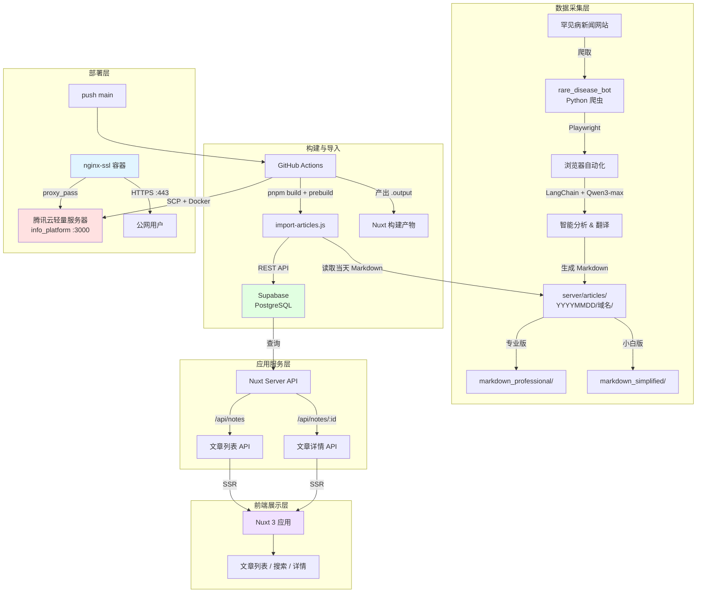

# Rare Disease Info Platform

一个基于 Nuxt 3 的罕见病文章平台，集成了智能新闻爬虫系统，用于收集、翻译和展示罕见病相关的新闻文章。

🌐 **在线访问**：[fshdyouth.com](https://fshdyouth.com)（HTTPS 由服务器 `nginx-ssl` 终结）

## 🏗️ 架构图


```mermaid
graph TB
    subgraph "数据采集层"
        A[罕见病新闻网站] -->|爬取| B[rare_disease_bot<br/>Python 爬虫]
        B -->|Playwright| C[浏览器自动化]
        C -->|LangChain + Qwen3-max| D[智能分析 & 翻译]
        D -->|生成 Markdown| E[server/articles/<br/>YYYYMMDD/域名/]
        E -->|专业版| F[markdown_professional/]
        E -->|小白版| G[markdown_simplified/]
    end

    subgraph "构建与导入"
        H[GitHub Actions] -->|pnpm build + prebuild| I[import-articles.js]
        I -->|读取当天 Markdown| E
        I -->|REST API| K[Supabase<br/>PostgreSQL]
        H -->|产出 .output| J[Nuxt 构建产物]
    end

    subgraph "应用服务层"
        K -->|查询| L[Nuxt Server API]
        L -->|/api/notes| M[文章列表 API]
        L -->|/api/notes/:id| N[文章详情 API]
    end

    subgraph "前端展示层"
        M -->|SSR| P[Nuxt 3 应用]
        N -->|SSR| P
        P --> Q[文章列表 / 搜索 / 详情]
    end

    subgraph "部署层"
        T[push main] --> H
        H -->|SCP + Docker| U[腾讯云轻量服务器<br/>info_platform :3000]
        V[nginx-ssl 容器] -->|HTTPS :443| W[公网用户]
        V -->|proxy_pass| U
    end

    style K fill:#e1ffe1
    style P fill:#f0e1ff
    style U fill:#ffe1e1
    style V fill:#e1f5ff
```

## ✨ 功能特性

- 📰 **文章展示**：文章列表、详情与 Markdown 渲染
- ✍️ **内容管理**：创建与编辑文章
- 🔍 **智能搜索**：罕见病相关信息检索
- 🤖 **智能爬虫**：自动爬取并翻译新闻（专业版 / 小白版）
- 🔄 **构建时导入**：`prebuild` 将当天爬取文章写入 Supabase
- 🎨 **响应式 UI**：支持移动端

## 🛠️ 技术栈

### 前端

- [Nuxt 3](https://nuxt.com) · [Vue 3](https://vuejs.org) · [TypeScript](https://www.typescriptlang.org) · [Sass](https://sass-lang.com)

### 后端与数据

- [Supabase](https://supabase.com)（PostgreSQL）
- Nuxt Server API

### 爬虫子项目 `rare_disease_bot`

- LangChain · Playwright · Qwen（通义千问）· Python 3

### 部署

- [GitHub Actions](.github/workflows/ci-cd.yml)（lint / test / build / 部署）
- 腾讯云轻量服务器 + Docker
- 宿主机 `nginx-ssl`（80/443，证书与反代配置在服务器上维护）

## 📁 项目结构

```
.
├── pages/                 # 页面路由
├── components/            # Vue 组件（含 SiteFooter 备案信息）
├── layouts/               # 布局（全站页脚）
├── server/
│   ├── api/               # API
│   ├── articles/          # 爬虫生成的 Markdown
│   └── scripts/
│       └── import-articles.js   # prebuild 导入脚本
├── rare_disease_bot/      # Python 爬虫
├── .github/workflows/     # CI/CD
├── Dockerfile             # 运行时镜像（仅 Node + .output）
├── docs/deploy-cloud.md   # 服务器与 GitHub 配置说明
└── scripts/docker-deploy-remote.sh
```

## 🚀 快速开始

### 环境要求

- Node.js >= 18
- pnpm（推荐）或 npm
- Python 3.8+（爬虫）
- Supabase 项目

### 1. 安装依赖

```bash
pnpm install
```

### 2. 环境变量

复制并填写 `.env`：

```bash
SUPABASE_URL=...
SUPABASE_KEY=...
SUPABASE_SERVICE_KEY=...   # prebuild 导入文章
NEXT_PUBLIC_SUPABASE_URL=...
NEXT_PUBLIC_SUPABASE_ANON_KEY=...
```

### 3. 本地开发

```bash
pnpm dev
```

访问 http://localhost:3000

### 4. 本地构建

```bash
pnpm build
pnpm preview
```

`pnpm build` 会先执行 `prebuild`（`import-articles.js`），导入 `server/articles/` 下**当天**目录中的专业版 Markdown。

## 📝 使用 rare_disease_bot 爬虫

爬虫需在**本地手动运行**。流程概览：

1. 在 `rare_disease_bot/` 配置 `.env` 并安装依赖（见 [rare_disease_bot/README.md](./rare_disease_bot/README.md)）
2. 运行 `python main.py --url ... --max-articles N`
3. 将 `server/articles/` 下新文章提交到仓库
4. **合并到 `main`** 后，GitHub Actions 在构建阶段执行 `prebuild` 导入数据库并部署

```bash
git add server/articles/
git commit -m "chore: 添加爬取的文章"
git push origin main   # 或在 PR 合并进 main 后自动部署
```

> 仅**当天**（按 `YYYYMMDD` 目录名）的文章会被 `import-articles.js` 导入。

## 🚢 生产部署

生产环境由 **GitHub Actions** 构建并部署到腾讯云，**不使用 Vercel**。

| 步骤 | 说明                                                                  |
| ---- | --------------------------------------------------------------------- |
| 触发 | `push` 到 `main`（非 PR）                                             |
| CI   | `pnpm lint` · `pnpm test`                                             |
| 构建 | `pnpm build`（含 prebuild）                                           |
| 发布 | SCP `.output` + `Dockerfile` 到服务器 → `docker build` / `docker run` |
| 入口 | `nginx-ssl` 提供 HTTPS，反代到应用 `:3000`                            |

详细配置（Secrets、Variables、防火墙、证书路径）见 **[docs/deploy-cloud.md](./docs/deploy-cloud.md)**。

### GitHub 仓库需配置

**Variables**：`DEPLOY_HOST`、`DEPLOY_PORT`（可选）、`APP_PORT`（默认 `3000`）等

**Secrets**：`DEPLOY_KEY`、`DEPLOY_USER`、`SUPABASE_*`、`POSTGRES_*`、`NEXT_PUBLIC_*` 等

Workflow 说明见 [.github/workflows/README.md](.github/workflows/README.md)。

## 🔄 开发流程

本仓库为**唯一生产仓库**（[OpenRareDisease/info_platform](https://github.com/OpenRareDisease/info_platform)），无 fork、无上游同步、无 Vercel。

```bash
git checkout -b feat/your-feature
pnpm lint && pnpm test
git push origin feat/your-feature
# GitHub 创建 PR → 合并 main → 自动部署
```

## 📚 开发指南

```bash
pnpm lint          # 检查
pnpm lint:fix      # 自动修复
pnpm format        # Prettier
pnpm test          # Vitest
```

提交前 Husky 会运行 lint-staged 与测试。测试说明见 [TEST_SETUP.md](./TEST_SETUP.md)。

## 🔧 数据与 API

- **导入**：构建时 `server/scripts/import-articles.js` → Supabase `notes` 表
- **API**：`GET/POST /api/notes`、`GET/PATCH /api/notes/:id` 等
- **展示**：Nuxt SSR 从 Supabase 读取

## 📖 相关文档

- [部署说明](./docs/deploy-cloud.md)
- [贡献指南](./CONTRIBUTING.md)
- [测试配置](./TEST_SETUP.md)
- [rare_disease_bot](./rare_disease_bot/README.md)
- [Nuxt 3 文档](https://nuxt.com/docs)
- [Supabase 文档](https://supabase.com/docs)

## 📄 License

[MIT License](LICENSE)
